# User Management System

This is a comprehensive user management platform that seamlessly integrates modern authentication, intelligent Open AI chat capabilities, and robust monitoring infrastructure. Built with monolith architecture, it provides secure user onboarding through OAuth2 and JWT authentication, real-time AI-powered conversations using OpenAI's streaming API, automated file management via asynchronous message queues, and complete observability through metrics collection and log analysis. The platform handles the entire user lifecycle from initial registration to ongoing engagement, while maintaining enterprise standards for security, scalability, and operational monitoring.

## 🏗️ Architecture Diagram

```mermaid
graph TB
    %% User Layer
    User[👤 User/Admin]
    
    %% Frontend Layer
    subgraph "Frontend Layer"
        React[🌐 React Frontend<br/>:3000]
    end
    
    %% Application Layer
    subgraph "Application Layer"
        Spring[⚙️ Spring Boot Backend<br/>:8080]
        RabbitMQ[📬 RabbitMQ<br/>:5672]
        OpenAI[🤖 OpenAI API<br/>External]
    end
    
    %% Data Layer
    subgraph "Data Layer"
        PostgreSQL[🗄️ PostgreSQL<br/>:5433]
    end
    
    %% Monitoring Layer
    subgraph "Monitoring & Observability"
        Prometheus[📊 Prometheus<br/>:9090]
        Grafana[📈 Grafana<br/>:3001]
        Elasticsearch[🔍 Elasticsearch<br/>:9200]
        Kibana[📋 Kibana<br/>:5601]
    end
    
    %% Connections
    User --> React
    React --> Spring
    Spring --> PostgreSQL
    Spring --> RabbitMQ
    Spring --> OpenAI
    Spring -.-> Prometheus
    Spring -.-> Elasticsearch
    Prometheus --> Grafana
    Elasticsearch --> Kibana
    
    %% Styling
    classDef frontend fill:#61dafb,stroke:#333,stroke-width:2px,color:#000
    classDef backend fill:#6db33f,stroke:#333,stroke-width:2px,color:#fff
    classDef database fill:#336791,stroke:#333,stroke-width:2px,color:#fff
    classDef queue fill:#ff6600,stroke:#333,stroke-width:2px,color:#fff
    classDef ai fill:#412991,stroke:#333,stroke-width:2px,color:#fff
    classDef monitoring fill:#e6522c,stroke:#333,stroke-width:2px,color:#fff
    classDef user fill:#4CAF50,stroke:#333,stroke-width:2px,color:#fff
    
    class User user
    class React frontend
    class Spring backend
    class PostgreSQL database
    class RabbitMQ queue
    class OpenAI ai
    class Prometheus,Grafana,Elasticsearch,Kibana monitoring
```



## What It Does

**User Journey:**
1. **Register/Login** → JWT authentication + Google OAuth
2. **Profile Setup** → Upload profile picture, update details  
3. **Dashboard** → Personalized user experience
4. **AI Chat** → Real-time streaming conversations with OpenAI
5. **File Management** → Automatic cleanup of unused photos via RabbitMQ

## Tech Stack

**Backend:** Spring Boot, JWT, OAuth2, WebFlux, RabbitMQ, PostgreSQL  
**Frontend:** React, SSE streaming  
**APIs:** REST + GraphQL  
**AI:** OpenAI GPT-3.5 streaming chat  
**Infrastructure:** Docker, Nginx, Message queues, file processing, rate limiting  
**Monitoring:** Prometheus, Grafana, Elasticsearch, Kibana

## Quick Start

```bash
# Full stack with monitoring
docker-compose up --build

# Development mode
cd backend && mvn spring-boot:run
cd frontend && npm install && npm start
```

## Key Features

- 🔐 **Secure Auth** - JWT + Google OAuth + session management
- 👤 **Profile Management** - Real-time updates, photo upload
- 🤖 **AI Streaming Chat** - OpenAI integration with conversation history
- 🗂️ **Smart File Cleanup** - RabbitMQ background processing
- 🏗️ **Modern Architecture** - REST/GraphQL, reactive streaming
- 📊 **Complete Observability** - Metrics, logs, dashboards, alerts

---

**User Management platform with intelligent AI integration and complete observability**
